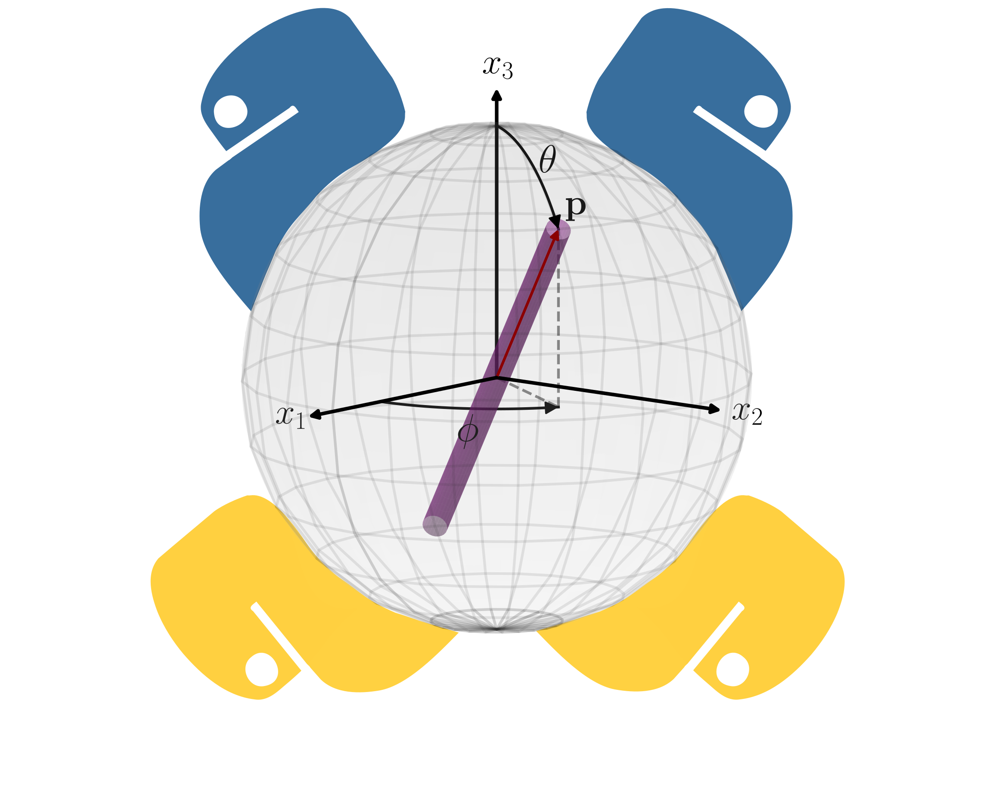

# This package provides functionality for computing the temporal evolution of the 2nd-order orientation tensor, $A_{ij}$ for a single material point using relevant state-of-the-art models and closure approximations.

----

## Folders:
* **closure_models** &rarr; Module with closure models
* **orientation_models** &rarr; Module with orientation models
* **orientation_models** &rarr; Module with plotting functionality
* **aux** &rarr; Folder with auxiliary information for this repository
----

## Files:
* *main.py* &rarr; Python script for general purpose integration of a single material point.
  
* *main_CGD.py* &rarr; Python script with Folgar-Tucker model for a center gated disk(CGD)

----
## Required Python Packages:
*   Numpy: '1.26.4'
*   Scipy: '1.11.4'
*   Pandas: '2.1.4'
*   Numba: '0.59.1'
*   Matplotlib: '3.8.0'

----
## How to run? 
* The Python Scripts are run with the following command:
'''
python <file of case study>
'''
* The *csv* files with the results for several fiber orientation models and closures are generated in the *data_check* folder.
* The generated files should be copied to the respective *postProcessData* folder of the associated case files.

----

The package was developed based on the work of Nils Meyer, Fiberoripy, available at: https://github.com/meyer-nils/fiberoripy.

The authors would also like to acknowledge other publicly available repositories dealing with fiber orientation modeling: 

* Charles L. Tucker III, Fiber-Orientation-Tools, https://github.com/charlestucker3/Fiber-Orientation-Tools

* Tianyi Li, Computational methods for fiber-reinforced composites, https://github.com/tianyikillua/fiberpy

The authors welcome suggestions to enrich this package. 